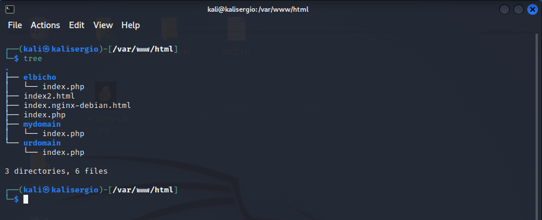

# Configuración básica de Apache

## Tarea 1

### Instalación básica

Actualizamos los repositorios con Kali. Instalamos Apache.

```bash
sudo apt-get update 
sudo apt-get install apache2
```
Instalamos el resto de paquetes de PHP

```bash
sudo apt-get install php libapache2-mod-php
sudo apt-get install php-mysql
```

Creamos el fichero index.php dentro de /var/www/html

```bash
sudo nano /var/www/html/index.php
```

Si queremos que aparezca la información sobre la instalación de PHP añadiremos el siguiente contenido en el index.html o index.php:

```php
<?php
    phpinfo();
?>
```

Pondremos la siguiente dirección en el navegador para que nos aparezca el contenido del index.php

```http
http://127.0.0.1/
```


### Instalación avanzada

Para esta instalación crearemos 2 dominios.

Entraremos en **/etc/hosts** y añadiremos 2 lineas con:

*127.0.0.1	mydomain.local*

*127.0.0.1	urdomain.local*


Entraremos dentro de **sites-available**:

```bash
cd /etc/apache2/sites-available
```
Creamos una carpeta en **/var/www/html** con el nombre del dominio.

```bash
sudo mkdir mydomain
sudo mkdir urdomain
```


Creamos el fichero **index.php** en cada uno de ellos con algun contenido que se pueda ver después desde el navegador:




Entramos en **sites-available**:

```bash
cd apache2/sites-available/
```
A continuación crearemos el fichero de configuración de los dominios cogiendo como plantilla el fichero **000-default.conf**:
```bash
sudo cp 000-default.conf mydomain.conf
sudo cp 000-default.conf urdomain.conf
```


Cambiaremos 2 lineas dentro de ambos ficheros.

```bash
<VirtualHost mydomain.local:80>
DocumentRoot /var/www/html/mydomain
```


Habilitamos los sitios con el comando:


```bash
sudo a2ensite mydomain
sudo a2ensite urdomain
```


Deshabilitaremos el **000-deafult** para que no nos aparezca su página al ingresar el dominio en el navegador:


```bash
sudo a2dissite 000-default
```


No nos olvidemos de recargar la configuración de Apache con el comando:


```bash
sudo systemctl reload apache2
```

Nos dirigimos al navegador e introducimos las direcciones del dominio puestas en el **/etc/hosts**


